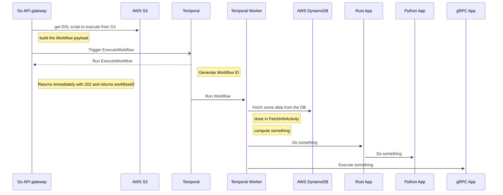

```mermaid
sequenceDiagram

    participant Go API gateway
    participant AWS S3
    participant Temporal
    participant Temporal Worker
    participant AWS DynamoDB
    participant Rust App
    participant Python App
    participant gRPC App

    Go API gateway ->>+ AWS S3: get DSL script to execute from S3
    Note right of Go API gateway: build the Workflow payload
    Go API gateway -) Temporal: Trigger ExecuteWorkflow
    Temporal -->>+ Go API gateway: Run ExecuteWorkflow
    Note right of Temporal: Generate Workflow ID
    Note right of Go API gateway: Returns immediately with 202 and returns workflowID
    Temporal ->>+ Temporal Worker: Run Workflow
    Temporal Worker ->>+ AWS DynamoDB: Fetch some data from the DB
    Note right of Temporal Worker: done in FetchInfoActivity
    Note right of Temporal Worker: compute something
    Temporal Worker ->>+ Rust App: Do something
    Rust App ->>+ Python App: Do something
    Temporal Worker ->>+ gRPC App: Execute something
```